# RAG Evolution

面向企业知识问答的评测驱动 RAG 质量运营与版本决策 Demo。

**唯一当前有效规格：[V1.4 + Phase 1 冻结合同（2026-10-08）](docs/RAG_SELF_EVOLUTION_SPEC.md)**。当前合同以SPEC文首为准；[ChangeLog](docs/SPEC_CHANGELOG.md)追加历史，[Current Demo Truth](docs/CURRENT_DEMO_TRUTH.md)区分真实Current与Legacy。历史验收只代表其日期的运行状态。

当前真实Knowledge：4 PDF / 157页、349 Parent / 368 Child、text-embedding-v4 1024d、368 Indexed、9 Topics。原Full 100（40/20/40，机器87/用户批准13）已由用户冻结为GD-20261008024214127995，保留原题、审批、历史质量记录及Legacy Production。新建独立Golden Dataset V2 Medium 50（20/10/20），角色/场景/意图与真实Child/Parent页码持久化，十维业务审计参与资格；当前真实机器结果与未解决项见[Medium V2验收](docs/MEDIUM_V2_POLISH_VERIFICATION.md)和[50题审阅报告](backend/reports/medium_v2_polish_review.md)。本轮不自动批准、冻结、Baseline或Agent。

Pipeline与Golden采用身份隔离的内存Cache/SWR；Current/Pool保留后端30条分页、前端滚动增量加载及详情懒加载。所有右侧Drawer共享单题详情母版 `--drawer-width:800px`，全高100dvh，小屏100vw。长期SPEC/图源同步规则见[AGENTS.md](AGENTS.md)。

## 产品闭环

`知识库 → Golden 规划与治理 → Gate 1 → Baseline / Bad Case → Optimization Agent → A/B/C → Sandbox / Regression → Gate 2 → 条件 D → Gate 3 人工发布 → Production → 问答验证 / Monitoring → 人工确认 Trigger → 下一轮优化`

只有 Optimization Agent 是主 Agent。Hard Gate 与 Regression 决定资格，Overall 仅用于比较；D 未通过或未优于 Winner 时保留 Winner。不自动改知识、调参、发布或回滚。

目标一级模块顺序：RAG 自进化项目概览、知识库、Pipeline 配置、Golden Dataset、Baseline、Agent 工作台、发布、问答验证。Monitoring 为问答验证二级 Tab；保留现有 Hash/兼容入口，目标名称与 H1 一致。

## V1.4 业务实施历史状态（截至 2026-10-02）

| 能力 | 当前证据与运行边界 |
| --- | --- |
| Current Baseline resolver、Experiment 绑定、Monitoring Confirm/首轮 | 共用身份解析、幂等 Confirm、Provider 锁外执行与 A/B/C 原子保存；P0 定向复审通过 |
| Golden V2、统一 Validator、Pool 匹配 | 现有 FAISS 向量规划、冻结 Plan/Slot、最大二分匹配；263 项阶段离线后端测试通过 |
| 双层 Probe、原解析全文、原子 bundle | CandidateK/Final Context 分层、失败与空召回分开；真实 4 PDF/157 页备份 Staging 兼容校验通过，真实 active 尚未升级 |
| Usage/Timing、价格版本与缺失原因 | 284 项阶段离线测试及复审通过；缺历史数据不补造，节假日计费不明时不报精确成本 |
| 八个模块与完整离线生命周期 | 296 项隔离后端、121 项前端、构建通过；Chromium 四尺寸 208 检查，54 ID 具名映射；最终复审通过，当时保留换材草案重新生成后关闭多一次提示的 Minor |

源码证据和需求 ID 对照见 [SPEC 第 3 节](docs/RAG_SELF_EVOLUTION_SPEC.md#3-需求追踪与当前实现证据)。当前冻结 Golden 不能因为文档更新而称为 V2 生成；历史未采集字段不回填。Snapshot、Baseline、Candidate 与 Production 分别保留自己的来源。

## Interview Demo 产品叙事（2026-10-03，Historical）

每个页面只回答当前阶段的问题：知识库技术选型 → Pipeline 的 Frozen / Agent Search Space → Golden 稳定评测基准 → Baseline 的 Hard Gate / Bad Case → 根因与受控 A/B/C 实验 → Sandbox / Regression 与条件 D → 人工发布 → 同题真实问答差异 → Monitoring 下一轮。只有概览保留全局闭环；其他页面删除重复 Stepper、流程图、大 KPI 与发布流水线。

主结论优先，文档/Evidence/Case/Search Space/完整配置/高级指标进入统一右侧 Drawer（当时标准560px/wide800px；已被当前唯一800px合同覆盖）。Sandbox 主表聚焦 Hard Gate、Bad Case、Regression、Qualification；A/B/C 统一 WHY / CHANGE / RESULT，D 独立说明组合失败为何保留 Winner。当前真实根因为 Generation 6 / Safety 1，不借示例虚构 Retrieval 失败。

方案对比固定正式 Baseline 对实际 active、人工已发布 Production，不提供任意方案选择器或 Qualified Candidate fallback，删除历史评测 UI/GET/缓存。Bad Case 选择后填入可编辑问题，只有主动点击才运行实时对比；答案双栏为重点。问答验证 Tab 顺序为问答验证 → 方案对比 → Monitoring。Input/Output Tokens 与费用分开；真实 0/false 保留，估算只使用完整 Usage 与冻结价格币种（当前 USD），缺历史计费依据不回算。

本轮业务与真实数据保护边界不变；唯一后端补充为现有 `GET /api/pipeline` 的实际索引 `dimension/indexed_count` 可空只读字段，不重建 FAISS、不调用真实 Provider。20–30 分钟完整讲解及现场手动调用边界见 [Runbook](docs/INTERVIEW_DEMO_RUNBOOK.md)。

## 当前正式架构（同源于项目概览）

以下图表达完整流程设计，当前运行结果仍由应用持久化对象决定；不代表Gate已批准或Baseline/Agent已运行。





唯一图源：[KnowledgeDiagrams.tsx](frontend/src/components/KnowledgeDiagrams.tsx) + [Shared CSS](frontend/src/styles.css)；[导出脚本](scripts/export_architecture.py)读取实际页面SVG和Computed Style，生成16:9 SVG/2560×1440 PNG与[校验Manifest](架构/architecture-manifest.json)。[平台说明](架构/RAG自进化平台架构说明.md)。旧HTML为Historical归档，不作为当前正式图。

## 本地启动与恢复

前置条件：Python 3.10+、Node.js 20+、npm。保留现有启动入口：

```bash
./start.sh
```

前端：[http://127.0.0.1:5174](http://127.0.0.1:5174)；API 文档：[http://127.0.0.1:8010/docs](http://127.0.0.1:8010/docs)。已有后台服务重启后先检查端口/PID/目录，避免另开重复进程。

手动启动方式仍为：

```bash
python3 -m pip install -r backend/requirements.txt
PYTHONPATH=backend python3 -m uvicorn app.main:app --port 8010
cd frontend && npm install && npm run dev
```

真实调用前在本地 `.env` 配置 `DEEPSEEK_API_KEY`。Key、真实 DB、备份和索引产物不提交 GitHub。Provider 不可用时返回明确状态，不创建模拟回答、评测或发布结果。相关 Chunk 会随显式回答/QC/Judge/Agent 请求发送给 Provider。

Golden 失败时保留已合格 Slot，使用现有补失败题入口；Probe/QC 中断使用现有重试入口，不重做已应用修订、不自动批准。历史 Snapshot 只读；历史详情与统一 Drawer 的最终验收见实施报告。

## Preview 与真实验证边界

**V1.4 Planner Preview 已实施**：Golden 当前测试集紧凑 Coverage 入口选择 Profile 后点击「预览当前 Corpus Coverage」，Legacy / 无 Run 页面也可使用；保存 Run 的冻结规划单独查看。`POST /api/governance/coverage-preview` 使用当前已存向量，返回动态 K、merge、Slot、材料与缺口；不调用生成/Judge/QC，不改变当前 Golden/Baseline/Production。Pool Preview 为 `POST /api/governance/generation-runs/from-pool/preview`。旧后台服务没有自动重启，使用新代码前须手动受控重启。

以下为Historical V1.4阶段手动验证清单，不能视为当前阶段授权；Baseline/Agent须后续单独授权：

1. 手动运行一次 Baseline vs Production 实时问答对比，查看真实回答、证据、Usage、Latency 与成本缺失原因。
2. Production QA → 人工判 Bad Case → Confirm Trigger → 手动启动首轮 Agent；可能创建实验并耗用 Provider/预算，不自动 Sandbox 或发布。
3. 运行 V2 Planner Preview，核对动态 K、小簇合并与 Slot，不接着自动生成 Golden。

若要将当前演示数据称为 V2，需要另行生成、人工审核并冻结 V2 Golden，然后在同一新 Snapshot 上执行 Baseline/实验与验证。未批准的 Seed / Legacy 候选不能冒充正式 Golden；当前正式 Legacy Snapshot 保留已有的人审资格与历史实测结果。Fixture / 离线 Stub 不能冒充真实 Provider 结果。

## 验证入口

隔离后端测试：`python3 scripts/test_v14_offline.py`；`cd frontend && npm test && npm run build`。测试必须使用隔离 DB/Stub，不消耗真实 Provider 配额；`scripts/test_phase1_ui.mjs` 仅允许隔离 :5180/:8011。

本轮 UI 与只读数据保护结果见 [Interview Demo 验收](docs/INTERVIEW_DEMO_VERIFICATION.md)；前轮业务代码结果见 [V1.4 实施验收](docs/V1_4_IMPLEMENTATION_VERIFICATION.md)，之前的文档/图交付记录见 [同步验收](docs/V1_4_DOCS_SYNC_VERIFICATION.md)。历史或 Stub 结果不代表真实 Provider 重跑。

## Phase 1 Knowledge Pipeline

本轮仅重构项目概览和知识库，新增真实 MinerU VLM → Table KV Normalize → Parent-Child → text-embedding-v4 → FAISS 与 qwen3-rerank / Parent Expand 检索。唯一规则源仍为 `docs/RAG_SELF_EVOLUTION_SPEC.md`，运行证据见 `docs/PHASE1_KNOWLEDGE_VERIFICATION.md`。

在本地 `.env` 配置独立 `MINERU_API_KEY`、`DASHSCOPE_API_KEY` 和与 Key 匹配的业务空间根地址 `DASHSCOPE_BASE_URL`。不把 Key 发到聊天或提交 Git。知识库点击“重建 Knowledge Pipeline”后展示持久化阶段；失败保留旧有效资产，成功激活后自动以 Full Profile 构建 Golden，并停在真实 Human Gate 1。新激活不迁移 Legacy Production，不自动评测或发布。
