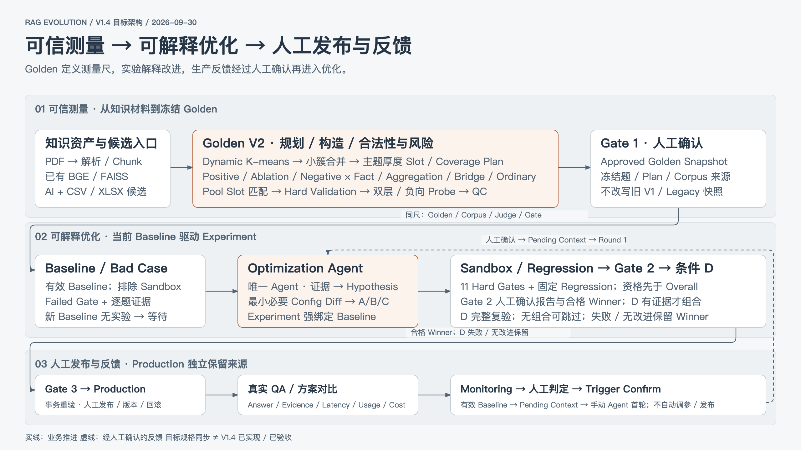
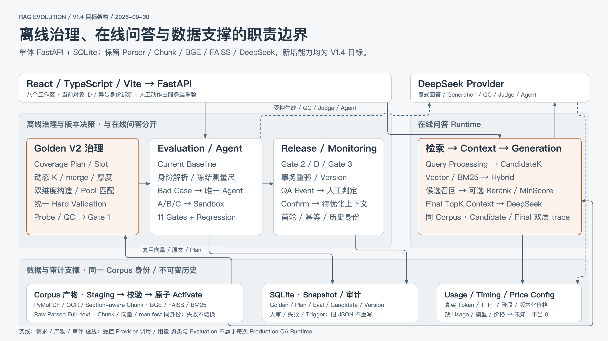

# RAG Evolution

面向企业知识问答的评测驱动 RAG 质量运营与版本决策 Demo。

**唯一当前目标规格：[SPEC V1.4](docs/RAG_SELF_EVOLUTION_SPEC.md)**（2026-09-30）。本次交付为规格与架构同步，V1.4 业务代码未在本次升级或验收。[SPEC ChangeLog](docs/SPEC_CHANGELOG.md) 记录历史；已保存 Demo 来源见 [Current Demo Truth](docs/CURRENT_DEMO_TRUTH.md)，既有实现验收见 [Phase 1 报告](docs/PHASE1_VERIFICATION.md)。这些历史证据不能替代 V1.4 验收。

## 产品闭环

`知识库 → Golden 规划与治理 → Gate 1 → Baseline / Bad Case → Optimization Agent → A/B/C → Sandbox / Regression → Gate 2 → 条件 D → Gate 3 人工发布 → Production → 问答验证 / Monitoring → 人工确认 Trigger → 下一轮优化`

只有 Optimization Agent 是主 Agent。Hard Gate 与 Regression 决定资格，Overall 仅用于比较；D 未通过或未优于 Winner 时保留 Winner。不自动改知识、调参、发布或回滚。

目标一级模块顺序：RAG 自进化项目概览、知识库、Pipeline 配置、Golden Dataset、Baseline、Agent 工作台、发布、问答验证。Monitoring 为问答验证二级 Tab；保留现有 Hash/兼容入口，目标名称与 H1 一致。

## 当前实现与 V1.4 目标

| 已有源码机制（历史验证见 Phase 1） | V1.4 目标增量（尚未在本次实施/验收） |
| --- | --- |
| 动态 Corpus、逐 Slot 保存/补题、Mini/Medium/Full Profile、业务 CSV/XLSX 候选池 | Dynamic K-means、小簇合并、主题厚度 Slot、AI/导入/Pool 共用 Plan 匹配 |
| Hard Validation、Probe/QC、人审与冻结快照 | 统一校验规则、Group × Construction、候选召回/Final Context 双层 trace、原解析全文 Negative Probe |
| Baseline、A/B/C、Sandbox、Regression、条件 D、人工发布与版本回退 | Current Baseline resolver、Experiment 强绑定、Monitoring Pending Context / 首轮 / 幂等 |
| 共享 UI、问答来源对比、实际阶段/Usage、可选集中价格配置 | 全局及逐页信息架构、成本缺失原因与价格版本、V1.4 全部离线验收 |

源码证据和需求 ID 对照见 [SPEC 第 3 节](docs/RAG_SELF_EVOLUTION_SPEC.md#3-需求追踪与当前实现证据)。当前冻结 Golden 不能因为文档更新而称为 V2 生成；历史未采集字段不回填。Snapshot、Baseline、Candidate 与 Production 分别保留自己的来源。

## 目标架构（V1.4）

两张图依据最新设计从头生成，表达目标职责与数据流，不证明当前 Demo 已具备全部新能力。





可编辑图源：[业务架构 HTML](架构/业务流程图.html) · [技术架构 HTML](架构/技术架构图.html)。模块边界及现有/目标差异见 [平台架构说明](架构/RAG自进化平台架构说明.md)。PNG 为 2560×1440；HTML 内嵌 SVG，可独立浏览。

## 本地启动与恢复

前置条件：Python 3.10+、Node.js 20+、npm。保留现有启动入口：

```bash
./start.sh
```

前端：[http://127.0.0.1:5174](http://127.0.0.1:5174)；API 文档：[http://127.0.0.1:8010/docs](http://127.0.0.1:8010/docs)。已有后台服务重启后先检查端口/PID/目录，避免另开重复进程；本次不启动或重启服务。

手动启动方式仍为：

```bash
python3 -m pip install -r backend/requirements.txt
PYTHONPATH=backend python3 -m uvicorn app.main:app --port 8010
cd frontend && npm install && npm run dev
```

真实调用前在本地 `.env` 配置 `DEEPSEEK_API_KEY`。Key、真实 DB、备份和索引产物不提交 GitHub。Provider 不可用时返回明确状态，不创建模拟回答、评测或发布结果。相关 Chunk 会随显式回答/QC/Judge/Agent 请求发送给 Provider。

Golden 失败时保留已合格 Slot，使用现有补失败题入口；Probe/QC 中断使用现有重试入口，不重做已应用修订、不自动批准。历史 Snapshot 只读；当前界面已有历史入口，移到统一 Drawer 是 V1.4 UI 目标。

## Preview 与真实验证边界

**V1.4 Planner Preview 是待实施能力**：目标入口为 Golden 的 Coverage 规划，使用当前已存向量，展示动态 K、merge、Slot、材料与缺口；不调用生成/Judge/QC，不改变当前 Golden/Baseline/Production。不在当前界面承诺已可使用的 V2 Preview 路由。

以下三项是 V1.4 实施及离线验收后的手动验证清单，本次未执行：

1. 手动运行一次 Baseline vs Production 实时问答对比，查看真实回答、证据、Usage、Latency 与成本缺失原因。
2. Production QA → 人工判 Bad Case → Confirm Trigger → 手动启动首轮 Agent；可能创建实验并耗用 Provider/预算，不自动 Sandbox 或发布。
3. 运行 V2 Planner Preview，核对动态 K、小簇合并与 Slot，不接着自动生成 Golden。

若要将当前演示数据称为 V2，需要另行生成、人工审核并冻结 V2 Golden，然后在同一新 Snapshot 上执行 Baseline/实验与验证。历史 Seed、Legacy、Fixture 或离线 Stub 均不是正式真实 Provider 结果。

## 验证入口

现有业务测试：`cd backend && python3 -m unittest discover -s tests`；`cd frontend && npm test && npm run build`。测试必须使用隔离 DB/Stub，不消耗真实 Provider 配额；`scripts/test_phase1_ui.mjs` 仅允许隔离 :5180/:8011。

本次文档/图检查与数据保护结果见 [V1.4 同步验收](docs/V1_4_DOCS_SYNC_VERIFICATION.md)。没有将既有测试数字重新记为 V1.4 业务通过。
