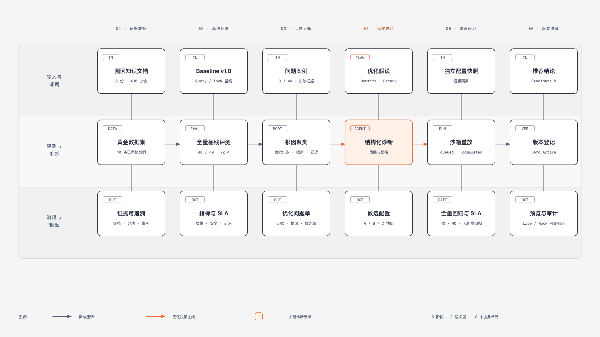
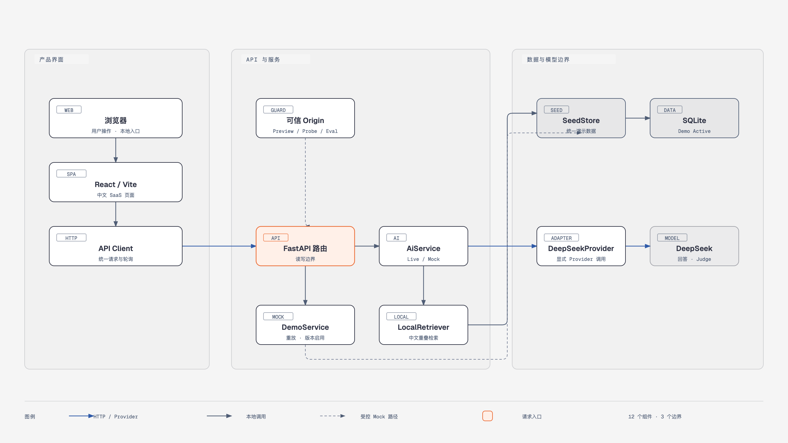

# RAG Evolution 平台架构说明

> 由评测证据驱动的 RAG 优化闭环 Demo

## 一、架构总览

RAG Evolution 面向园区运营知识助手场景，展示从知识与黄金数据集、基线评测、问题案例诊断，到候选配置、沙箱重放、全量回归和版本登记的可审计优化闭环。

上图使用“输入与证据、评测与诊断、治理与输出”三层稳定语义，展开为证据准备、基线评测、问题诊断、优化设计、隔离验证和版本决策六个阶段，避免把“闭环”简化成只有几个节点的环形示意。

核心事实：本地知识库接口当前返回 6 份文档、438 个分块；黄金数据集包含 40 个已审核案例，基线识别出 8 个问题案例。候选方案 B 的历史演示结果为 87.6，且只有在 40/40 回归、质量、安全和延迟闸门均通过、没有新增回归时才会被推荐。

## 二、业务闭环

业务闭环的中心不是自动改写线上配置，而是把每一轮优化的证据、配置和结果登记为可追溯记录。

1. **知识与数据集**：园区服务、服务标准、设备运维和安全应急等文档形成可检索证据；正向、口语化与负向案例构成黄金数据集。
2. **基线评测**：使用完整 40 条数据集生成基线指标和 SLA 状态，而非只挑选单个案例验证。
3. **问题案例诊断**：将失败按检索失败、检索噪声、过度拒答和延迟等类型聚合，保留问题、预期回答、证据与根因。
4. **候选配置**：针对诊断结果形成 A/B/C 配置快照，比较 Query Rewrite、Multi Query、Rerank 与 TopK 等策略。
5. **沙箱重放**：在逻辑隔离的 Demo 运行中展示排队、运行、评测、完成；其指标来自预置重放数据。
6. **全量回归与 SLA**：对所有 40 条案例检查质量、安全、延迟和新增回归，不通过任何闸门即不推荐。
7. **版本登记与预览**：Candidate B 可被设为 Demo Active；预览页面可将基线样例与本次 Live 或 Mock 候选回答并列展示。

## 三、一次问答与评测的数据流

### 预览问答

`浏览器 → POST /api/preview → AiService → LocalRetriever → SQLite 种子文档`

未配置 `DEEPSEEK_API_KEY` 时，`AiService` 返回明确标记的 Mock 回退结果。已配置且用户显式点击预览时，本地检索先选取相关证据片段，再由 `DeepSeekProvider` 调用 DeepSeek；响应中返回 `mode`、`model`、`latency_ms`、检索来源和回退原因。

### 真实评测

`浏览器 → POST /api/evaluations/live → AiService → 逐条检索与回答 → DeepSeek Judge → 聚合结果`

真实评测最多执行 40 条。每条 Live 评测会向模型发送问题、相关知识片段、预期回答与生成回答；不上传原始文件。未配置 Provider 时接口明确返回 Mock 模式与未执行原因。

## 四、技术架构与模块关系

上图按产品界面、API 与服务、数据与模型边界分为三个区域，展开 12 个已实现组件；实线代表本地或 Provider 调用，虚线代表受控的 Mock 状态路径。

| 模块 | 职责 | 主要边界 |
| --- | --- | --- |
| React / Vite | 提供中文 SaaS 页面、实验轮询、版本管理、预览与设置 | 只调用 FastAPI API，不直接读取密钥或调用模型 |
| FastAPI 路由 | 暴露工作区、知识、评测、实验、版本、预览和 readiness 接口 | 对预览、探测与真实评测校验可信 Origin |
| `DemoService` | 创建模拟重放、返回 `queued → running → evaluating → completed`、启用 Demo 版本 | 不产生本次 Live 实验结论 |
| `AiService` | 统一 readiness、Probe、预览、真实评测及 Mock 回退 | 根据 API Key 与 `RAG_FORCE_MOCK` 决定模式 |
| `LocalRetriever` | 对种子文档执行透明的中文字符/词元重叠检索 | 不是向量检索实现 |
| `SeedStore` / SQLite | 保存统一种子数据、演示状态和 Demo Active 版本 | 不保存 API Key |
| `DeepSeekProvider` | 通过 OpenAI-compatible Chat Completions 调用回答与 Judge | 仅在用户显式触发时访问外部模型 |

## 五、状态生命周期

### 模拟实验

| 状态 | 表示 | 返回内容 |
| --- | --- | --- |
| `queued` | 已创建，等待重放开始 | A/B/C 均为 0/40 |
| `running` | 依次执行候选配置 | 每个候选方案的完成数 |
| `evaluating` | 已完成候选运行，进行统一评测 | 三个候选方案均为 40/40 |
| `completed` | 重放结束 | 预置推荐结论与回归结果 |

### AI readiness

| 模式 | 条件 | 行为 |
| --- | --- | --- |
| Mock | 未配置 `DEEPSEEK_API_KEY` 或 `RAG_FORCE_MOCK=1` | 不调用 Provider，返回可见的 Mock 标识和原因 |
| Live 未验证 | 已配置 API Key，尚未 Probe | 允许用户显式验证连接 |
| Live 可用 | Probe 成功 | 预览和真实评测可调用 DeepSeek，并返回模型与延迟 |
| 不可用 | Probe 或调用失败 | 清除旧结果，返回原因并允许重试 |

## 六、核心 API 边界

| 分组 | 接口 |
| --- | --- |
| 工作区与证据 | `GET /api/overview`、`/api/workspace`、`/api/documents`、`/api/dataset` |
| 评测与优化 | `GET /api/evaluation`、`/api/bad-cases`、`/api/optimization` |
| 实验与版本 | `POST /api/experiments/run`、`GET /api/experiments/{id}`、`POST /api/versions/{id}/activate` |
| 模型能力 | `GET /api/readiness`、`POST /api/ai-readiness/probe`、`POST /api/preview`、`POST /api/evaluations/live` |

## 七、推荐闸门与能力边界

Candidate B 的推荐条件同时成立：

- 回归完成 `40 / 40`；
- 质量、安全、延迟 SLA 全部通过；
- 新增回归数为 `0`。

Candidate A 因延迟不通过，Candidate C 因质量不通过。Demo 中的实验重放、候选指标和推荐结论均明确来自预置演示数据；版本启用仅改变 Demo Active 状态，不部署到外部生产系统。

真实模式只覆盖手动 Probe、预览和真实评测：本地检索的相关片段会随用户问题发给 DeepSeek，Judge 还会接收预期回答与生成回答。普通页面加载、模拟重放和本地数据读取不会调用模型。

## 八、后续演进方向

后续可在不改变现有 UI/API 观察边界的前提下，接入真实语料解析与索引、可复现的 RAG 运行时、真实候选配置执行，以及持久化的评测历史与审计记录。当前 Demo 不宣称已具备这些生产能力。
